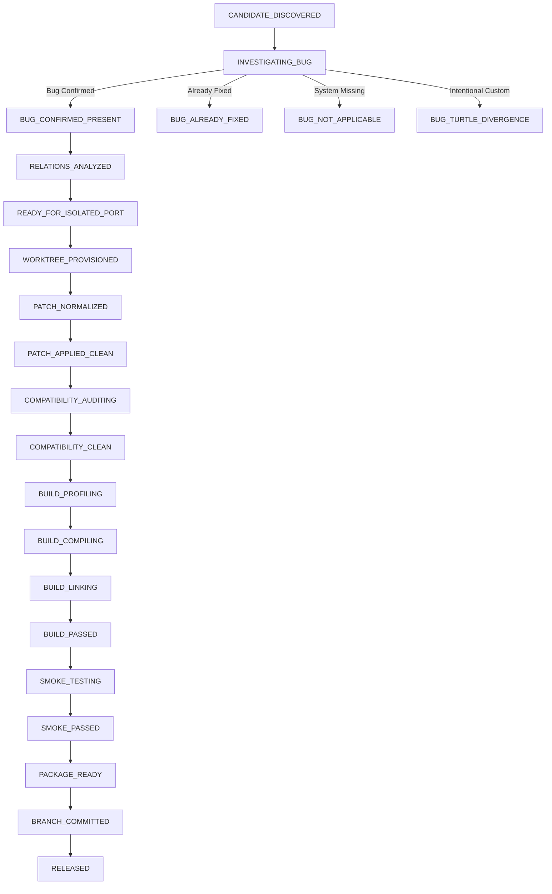

# Turtle-WoW Orchestration & AI Multi-Agent Engineering Framework
### *The Next-Generation 2.0 Total Revamp Architecture*

[-brightgreen.svg)](tests/AllTests.Tests.ps1)
[](config/twow-project.json)
[-orange.svg)](https://github.com/Ildourol/tortoise-wow-extended)
[](tools/modules/StateMachine.ps1)
[](tools/modules/WorktreeManager.ps1)
[](config/authority-policy.json)

---

## 1. Executive Summary: The 2.0 Total Revamp

This repository houses the **complete autonomous multi-agent engineering framework, porting toolchain, reverse engineering tools, and operational methodology** for **Tortoise-WoW Extended** (targeting Turtle-WoW 1.18.1, Build 7272).

### Why the Total Revamp?
The 2.0 engineering overhaul transforms what was once a set of manual porting scripts into a **hardened, deterministic, non-destructive, enterprise-grade autonomous engineering platform**. 

Key capabilities introduced in the Total Revamp:

- **100% Non-Destructive Git Worktree Isolation**: Builds, patch application, and verification run strictly in ephemeral `.worktrees/PORT-XXXX/` workspaces. The main target server tree ([`tortoise-wow/`](tortoise-wow/)) is **never dirtied, reset, or modified**. All destructive git commands (`git checkout .`, `git reset --hard`, `git clean -fd`) have been permanently eliminated. Fixes are committed to isolated candidate branches (`port/PORT-XXXX-<sha>`).
- **Deterministic Bug-Existence Prover (`task prove <sha>`)**: Proves whether an upstream bug actually exists in the target core before writing any code. Classifies candidates into `BUG_PRESENT`, `ALREADY_FIXED`, `NOT_APPLICABLE`, `TURTLE_INTENTIONAL_DIVERGENCE`, or `UNCERTAIN`.
- **Multi-Factor Priority Engine (`task rank`, `task next`)**: 12-factor scoring algorithm dynamically evaluates crash severity, player impact, exploit potential, dependency readiness, and target churn to prioritize high-value fixes and reject non-applicable commits with 0-score gates.
- **Dynamic Verification Modes & Auto-Escalation (`task port -Mode <Fast|Normal|Deep>`)**:
  - **Fast**: Quick diff triage, syntax validation, and bug proving (dry-run safe).
  - **Normal**: Isolated worktree build, patch-aware profile compilation, and schema audit.
  - **Deep**: Full multi-daemon compilation (`world` + `auth`), startup smoke tests, crash triage, and binary parity audit.
  - *Auto-escalates* upon detecting database migrations, missing dependencies, security patches, or opcodes; *never downgrades*.
- **Canonical 30-State Atomic State Store**: Transitions are validated by transition guards and persisted atomically to [`tools/state/state_store.json`](tools/state/state_store.json) with unique run IDs (`RUN-yyyyMMdd-HHmmss-xxxx`) supporting safe resumption and idempotency.
- **Database Migration Safety & Cached Catalog**: Audits SQL migrations against 413 tables in [`config/schema_catalog.json`](config/schema_catalog.json) using statement-anchored multiline regex (`(?m)^\s*`). Enforces entity-specific custom ID boundaries (`spell_template` >= 40000; world templates >= 300000) and forbids legacy progressive versioning columns (`tw_world_progressive_`).
- **Binary Client-Data Parity Auditor (`task parity`)**: Directly parses WDBC binary files from [`reference-upstreams/client-data-1.18.1/`](reference-upstreams/client-data-1.18.1/) and verifies alignment across races (`MAX_RACES = 11`), maps, spells, and items.
- **Automated Triage & Disposable Smoke Tests**: Catches regressions before merge via disposable daemon startup smoke tests (`realmd.exe` / `mangosd.exe`) and 17-category categorized server log / crash frame triage.
- **Full Test Suite & CI/CD**: 38 Pester unit tests covering all invariants, schemas, worktrees, and transitions running in sub-7 seconds via `task test` and backed by GitHub Actions workflows.

---

## 2. External Component Architecture & Setup Mini-Guide

To maintain repository purity and zero Git bloat, **server code, compiled binaries, heavy reference dumps, and raw forum archives are tracked in separate dedicated companion repositories**. This repository acts as the master orchestrator:

```text
twow project/
├── .github/workflows/                 [CI/CD: Orchestration & Candidate Workflows]
├── config/                            [Canonical JSON Configs, Policies, Schemas & Table Catalog]
├── docs/                              [Master Documentation, Commit Dossiers & Command Reference]
├── tests/                             [Pester Test Suite: AllTests.Tests.ps1]
├── tools/
│   ├── modules/                       [Modular PowerShell 2.0 Engine Modules]
│   ├── porting/                       [Core Porting, Scalping, & Packaging Pipeline]
│   ├── queue/                         [Staging Queue & Porting Dossiers]
│   ├── state/                         [Canonical state_store.json & Active Runs]
│   ├── tasks/                         [Specialized Agent Operational Handbooks]
│   └── task.ps1                       [Universal CLI Dispatcher]
│
├── tortoise-wow/                      [LOCAL CLONE: Target Turtle-WoW Server Core C++]
├── resources/
│   ├── FORUM_RESOURCE_GUIDE.md
│   └── forum/                         [LOCAL CLONE: 22,155 Archived Forum Threads]
└── reference-upstreams/               [LOCAL CLONE: Donors, DBCs & Historical References]
    ├── vmangos-core/                  [LOCAL CLONE: VMaNGOS Donor C++ & SQL]
    ├── client-data-1.18.1/            [LOCAL CLONE: 158 Client DBCs, Maps, Vmaps, Mmaps]
    ├── lights-hope-database-history/  [LOCAL CLONE: Brotalnia Vanilla World DB]
    └── elysium-core/                  [LOCAL CLONE: Historical Elysium Reference Core]
```

### Companion Repositories & Download Sources

| Component | Target Local Path | Repository URL / Upstream Source | Description |
| :--- | :--- | :--- | :--- |
| **Server Code Repository** | `tortoise-wow/` | [`Ildourol/tortoise-wow-extended`](https://github.com/Ildourol/tortoise-wow-extended) | Active Turtle-WoW 1.18.1 C++ source tree (branch `main`). |
| **Forum Intelligence Archive** | `resources/forum/` | [`Ildourol/turtle-wow-forum-archive`](https://github.com/Ildourol/turtle-wow-forum-archive) | 22,155 historical official forum threads (2018–2026). |
| **Client Assets (1.18.1)** | `reference-upstreams/client-data-1.18.1/` | [`Ildourol/Twow_data-1.18.1`](https://github.com/Ildourol/Twow_data-1.18.1) | 158 DBCs, 2,805 maps, 2,133 mmaps, 6,921 vmaps. |
| **Historical World Database** | `reference-upstreams/lights-hope-database-history/` | [`Ildourol/database`](https://github.com/Ildourol/database) | Authoritative Brotalnia vanilla DB (`world_full_14_june_2021.sql`). |
| **Primary Donor Core** | `reference-upstreams/vmangos-core/` | [`vmangos/core`](https://github.com/vmangos/core) | Upstream vanilla 1.12.1 emulator (development branch). |
| **Historical Core Reference** | `reference-upstreams/elysium-core/` | [`lduguid/core`](https://github.com/lduguid/core) | Historical Nostalrius/Elysium core reference. |

### Quick Setup Commands (PowerShell)
```powershell
# 1. Clone server core repository
git clone https://github.com/Ildourol/tortoise-wow-extended.git tortoise-wow

# 2. Clone forum intelligence archive
git clone https://github.com/Ildourol/turtle-wow-forum-archive.git resources/forum

# 3. Create reference upstreams directory
New-Item -ItemType Directory -Path "reference-upstreams" -Force | Out-Null

# 4. Clone donor and reference repositories
git clone https://github.com/vmangos/core.git reference-upstreams/vmangos-core
git clone https://github.com/Ildourol/Twow_data-1.18.1.git reference-upstreams/client-data-1.18.1
git clone https://github.com/Ildourol/database.git reference-upstreams/lights-hope-database-history
git clone https://github.com/lduguid/core.git reference-upstreams/elysium-core
```

---

## 3. The 30-State Canonical Pipeline Architecture

Every candidate fix traverses a validated state transition graph. Direct state leaps or illegal transitions are forbidden by `Assert-StateTransition`:



---

## 4. Master Command Reference (`tools/task.ps1`)

The universal dispatcher [`tools/task.ps1`](tools/task.ps1) executes seamlessly from any directory without requiring `cd`:

### Core Verification, Testing & Proving Commands
| Command | Syntax | Description |
|---|---|---|
| **Test Suite** | `task test` | Runs the full 38-spec Pester unit test suite (`AllTests.Tests.ps1`). |
| **Bug Prover** | `task prove <sha>` | Runs deterministic bug prover (`BUG_PRESENT`, `ALREADY_FIXED`, `NOT_APPLICABLE`, `TURTLE_DIVERGENCE`). |
| **Next Candidate** | `task next` | Picks and displays highest-scoring backlog candidate via 12-factor ranking. |
| **Rank Backlog** | `task rank` | Evaluates and ranks all candidates with priority scores (0.0–100.0). |
| **Candidate Plan** | `task plan <sha> [-DryRun]` | Evaluates candidate plan and displays full DryRun report without modifying git. |
| **Relations** | `task relations <sha>` | Analyzes git history, reverts, and supersession links for a commit. |
| **Dependencies** | `task dependencies <sha>` | Resolves predecessor commits required before porting candidate. |

### Build, Smoke & Operational Commands
| Command | Syntax | Description |
|---|---|---|
| **Port Candidate** | `task port <sha> [-Mode Fast\|Normal\|Deep]` | Executes isolated porting pipeline in `.worktrees/PORT-XXXX/`. |
| **Port Batch** | `task port-batch [-Count N]` | Ports the next `N` highest-priority candidates sequentially. |
| **Build Profile** | `task build-profile <sha>` | Identifies minimal build profile (`world`, `auth`, `sql-only`, `docs-only`). |
| **Baseline Health** | `task baseline` | Inspects and caches target repository baseline compile/link/startup health. |
| **Smoke Test** | `task smoke <worktree_dir>` | Runs disposable startup smoke tests on `realmd.exe` and `mangosd.exe`. |
| **Crash Triage** | `task crash <crash_log>` | Parses stack frames, assertion failures, and minidump logs. |
| **Log Triage** | `task triage <server_log>` | Classifies server logs into 17 distinct operational categories. |
| **Parity Audit** | `task parity` | Audits client WDBC data against C++ source (`MAX_RACES = 11`, maps, spells). |

### System Integrity & Documentation Commands
| Command | Syntax | Description |
|---|---|---|
| **Config Check** | `task config-check` | Validates configuration integrity and discovered repository paths. |
| **State Check** | `task state-check` | Verifies state store schema (`1.0.0`) and transition integrity. |
| **Status Overview** | `task status` | Displays backlog overview, ready packages, and active state metrics. |
| **State Summary** | `task state` | Displays active run IDs, registered candidates, and state counts. |
| **Worktree Cleanup**| `task worktree-cleanup <id>` | Safely dismantles isolated worktree in `.worktrees/PORT-XXXX/`. |
| **PDF Generation** | `task pdf` | Compiles markdown documentation into printable HTML and PDF references. |
| **Legacy Aliases** | `task 1` through `task 6` | Preserved legacy shortcuts mapped to modern pipeline stages. |

---

## 5. Safety Invariants & Source Authority

All automated operations strictly observe the **9-Tier Authority Policy** defined in [`config/authority-policy.json`](config/authority-policy.json) and invariants in [`config/turtle-compatibility.json`](config/turtle-compatibility.json):

1. **Target Tortoise-WoW Checked-Out Source is King**: Vanilla assumptions never override Turtle custom mechanics.
2. **Race Parity Invariant**: `MAX_RACES = 11` (Goblins and High Elves must never be truncated to 10).
3. **Debuff System Invariant**: `sTWDebuff` debuff limit system must be preserved. Vanilla debuff limit alterations are rejected.
4. **Script Command Invariant**: `SCRIPT_COMMAND_TAKE_MONEY = 93` and related Turtle script commands are protected.
5. **Entity-Specific Custom ID Boundaries**:
   - `spell_template`: IDs **>= 40,000** are custom Turtle spells (e.g., Holy Strike, Moonfury).
   - World Templates: IDs **>= 300,000** are custom Turtle items, creatures, quests, and gameobjects.
6. **No Progressive Database Pollution**: Tables/columns matching `tw_world_progressive_` are strictly rejected.
7. **Single-Writer State Store**: Only the primary orchestration agent may write to [`tools/state/state_store.json`](tools/state/state_store.json). Background subagents operate in read-only mode.

---

## 6. Verification Modes & Auto-Escalation

```text
┌───────────────────────────────────────────────────────────────────────────────────────┐
│                                VERIFICATION MODES                                     │
├──────────────────────┬────────────────────────────────┬───────────────────────────────┤
│ FAST MODE            │ NORMAL MODE                    │ DEEP MODE                     │
│ Diff & Syntax Audit  │ Worktree Isolation Build       │ Full Multi-Daemon Build       │
│ AST Invariants Check │ Patch-Aware Minimal Profile    │ Startup Smoke Test            │
│ Bug Prover Only      │ Schema Audit & Provenance      │ Log Triage & Parity Audit     │
└──────────┬───────────┴───────────────┬────────────────┴───────────────────────────────┘
           │                           │
           │ DB migration detected     │ Core subsystem / opcode / security fix
           └──────────────► ESCALATES ─┴──────────────────────────────► ESCALATES
```
- **One-Way Escalation**: The mode engine auto-escalates to ensure complete verification.
- **Zero Downgrades**: Explicitly requested modes are never downgraded.

---

## 7. Documentation Index

The complete engineering documentation suite is organized in [`docs/`](docs/):

- **[`docs/COMMAND_REFERENCE.md`](docs/COMMAND_REFERENCE.md)** — Master CLI Reference across all 23 mandated sections. Also available as printable PDF: **[`docs/COMMAND_REFERENCE.pdf`](docs/COMMAND_REFERENCE.pdf)**.
- **[`AGENTS.md`](AGENTS.md)** — Autonomous agent operating protocol, 9-tier authority hierarchy, single-writer rules, and definition of done.
- **[`ENGINEERING_HANDBOOK.md`](ENGINEERING_HANDBOOK.md)** — Technical handbook, safety danger zones, custom ID boundary rules, and porting recipes.
- **[`MULTI_AGENT_WORKFLOW.md`](MULTI_AGENT_WORKFLOW.md)** — Multi-agent concurrent engineering system operational guide.
- **[`ORCHESTRATION_WORKFLOW.md`](ORCHESTRATION_WORKFLOW.md)** — Porting pipeline lifecycle runbook and candidate branch release gate.
- **[`PORTING_PLAN.md`](PORTING_PLAN.md)** — 5-Phase strategic porting plan and deduplicated backlog tracking.
- **[`docs/ROADMAP.md`](docs/ROADMAP.md)** — Master roadmap across 5,092 deduplicated crucial candidates.
- **[`docs/UPSTREAM_COMPATIBILITY_LEDGER.md`](docs/UPSTREAM_COMPATIBILITY_LEDGER.md)** — Compatibility invariants reference.
- **[`docs/PORTING_TROUBLESHOOTING_AND_SAFEGUARDS.md`](docs/PORTING_TROUBLESHOOTING_AND_SAFEGUARDS.md)** — Troubleshooting playbooks and safeguards.

---

## 8. Continuous Integration & Quality Assurance

Orchestration and candidate builds are continuously validated through GitHub Actions:
- **[`.github/workflows/orchestration-ci.yml`](.github/workflows/orchestration-ci.yml)**: Validates PowerShell syntax, project configuration schemas, canonical state transitions, and executes the complete 38-spec Pester test suite on every commit to `main`.
- **[`.github/workflows/server-candidate-ci.yml`](.github/workflows/server-candidate-ci.yml)**: Automatically compiles candidate branch worktrees under MSVC 2022 and runs daemon startup smoke tests on `port/**` branch pushes.
