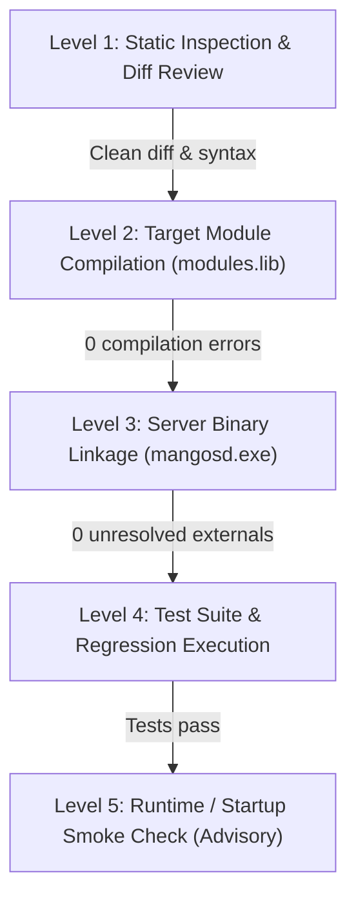

# Build & Verification Ladder Specification

## 1. The Multi-Tier Verification Ladder

A source file compiling is **never** sufficient proof that a port is complete or correct. All candidate ports must climb the verification ladder individually on a strict **commit-by-commit** basis before committing and pushing:



### 1.1. Level 1: Static Inspection & Diff Review
- Review `git diff` for unintended edits, whitespace noise, or stray files.
- Verify that no foreign dependencies or unmapped symbols were introduced.
- Cross-check against `modules/mod-playerbots/cmangos-compat-shim.h` to ensure macro/type consistency.

### 1.2. Level 2: Target Module Compilation
- Compile affected source files and the aggregate static library `modules.lib`.
- Command:
  ```powershell
  & "C:\vcpkg\downloads\tools\cmake-4.4.2-windows\cmake-4.4.2-windows-x86_64\bin\cmake.exe" `
    --build "tortoise-wow-extended/build" --target modules --config Release --parallel 4
  ```

### 1.3. Level 3: Server Binary Linkage
- Build target `mangosd` to prove that all symbols referenced by PlayerBots and Dungeon Clear resolve against the core engine without unresolved externals.
- Command:
  ```powershell
  & "C:\vcpkg\downloads\tools\cmake-4.4.2-windows\cmake-4.4.2-windows-x86_64\bin\cmake.exe" `
    --build "tortoise-wow-extended/build" --target mangosd --config Release --parallel 4
  ```

### 1.4. Level 4: Test Suite Execution
- When available, run specific unit/regression suites (e.g. `dungeon_clear_tests`).

### 1.5. Level 5: Runtime & In-Game Validation
- Runtime gameplay behavior (bot movement, boss encounters, looting, chat commands) cannot be fully certified by static compilation.
- In reports, explicitly distinguish between **proven link verification** and **unexercised runtime behavior**.

---

## 2. Baseline Failure vs. Port-Caused Failure Rule

- Before diagnosing a build error as a defect in a candidate port, verify if the unmodified baseline reproduces the issue.
- If a failure is proven pre-existing:
  1. Record it as `BASELINE_FAILURE` in the audit notes.
  2. Do not expand porting scope to fix unrelated baseline issues without explicit instruction.
  3. If a failure is introduced by the candidate, it is a `PORT_CAUSED_FAILURE` and must be resolved before proceeding.
