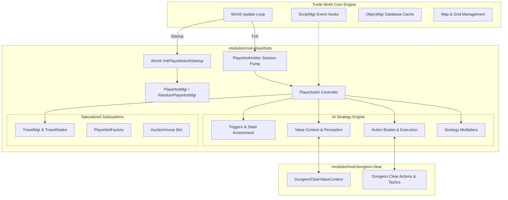

# PlayerBots Subsystem Architecture

## 1. Architectural Overview

The PlayerBots subsystem in **Turtle WoW Extended** (`modules/mod-playerbots`) enables intelligent, AI-controlled player characters to populate the world, form groups with players, run dungeons, engage in PvP, trade, craft, and participate in the economy.

The architecture is derived from the CMaNGOS / ike3 PlayerBots lineage and ported natively into Turtle WoW's module system.

---

## 2. Core Lifecycle & Thread Ownership

### 2.1. Threading & World Ownership
- **Single World-Owner Session Pump**: `PlayerbotHolder::UpdateAllHolderSessions` is the sole world-owner synthetic session pump after map tasks join.
- **Lifetime Safety**: Snapshot entries carry a holder generation count. Callbacks can remove or replace a later holder without dispatching against a stale lifetime.
- **Lock Ordering Invariant**: Registry and bot manager locks must **never** span native packet handlers or teleport dispatches to prevent deadlocks with map and object locks.
- **Socketless Session Management**: Synthetic bot sessions lack client sockets. Teleportation uses native near/far teleport ACK handlers, revalidating player and session ownership before resuming execution.

### 2.2. Bot Provisioning & Initialization
- Controlled by `RandomPlayerbotFactory::CreateRandomBots`.
- Account-creation futures and character-save futures are handled in separate bounded windows (8 concurrent tasks maximum) to prevent `std::future_error` exceptions.
- Sequence: Native `SaveToDB` $\rightarrow$ cache registration with session attached $\rightarrow$ player/session cleanup.

---

## 3. Strategy Pattern & Decision Engine

The AI decision cycle executes through the following stages:

1. **Value Context Perception**:
   - Dynamic perception queries registered in `AiObjectContext`.
   - Examples: `health`, `mana`, `nearest monsters`, `party member to heal`, `tank target`, `loot strategy`.
   - Evaluated lazily or cached per AI tick.
2. **Trigger Evaluation**:
   - Triggers continuously inspect value contexts (e.g. `LowHealthTrigger`, `PanicTrigger`, `EnemyPlayerNearTrigger`).
   - If conditions match, triggers emit relevant actions with associated priority weights.
3. **Action Basket & Execution**:
   - Candidate actions are gathered into `ActionBasket`.
   - Priorities are dynamically modified by `Multiplier` plugins based on combat role, stance, or dungeon strategy.
   - The action with highest net priority is executed via `Action::Execute(Event& event)`.
4. **Strategies**:
   - Groups of triggers, actions, and multipliers grouped into cohesive playstyles (e.g. `dps`, `heal`, `tank`, `rpg`, `stay`, `follow`, `dungeon`).

---

## 4. Navigation & MMAP Pathing

- **TravelMgr**: Evaluates high-level destination goals (quests, trainers, dungeon entrances, exploration).
- **TravelNode Network**: Forms a topological graph across world maps using extracted MMAP data.
- **Transport Handling**: Interacts with boats, zeppelins, and elevators (`GenericTransport` / `Transport`), ensuring bots board and disembark without endless teleport looping.

---

## 5. Compatibility Seams

Because upstream CMaNGOS evolves independently, `cmangos-compat-shim.h` bridges structural type divergence:
- `GuidSet` mapped to native `ObjectGuidSet`.
- `UnitAI` mapped to native `CreatureAI`.
- `GenericTransport` mapped to native `Transport`.
- `AreaTableEntry` mapped to native `AreaEntry`.
- `AreaTrigger` mapped to native `AreaTriggerEntry`.

Target-native APIs always take precedence over foreign shims.
